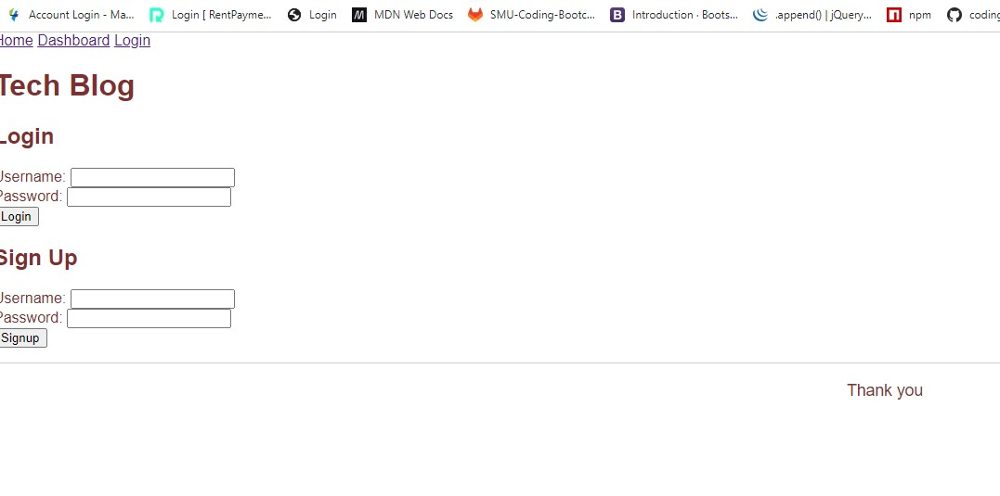
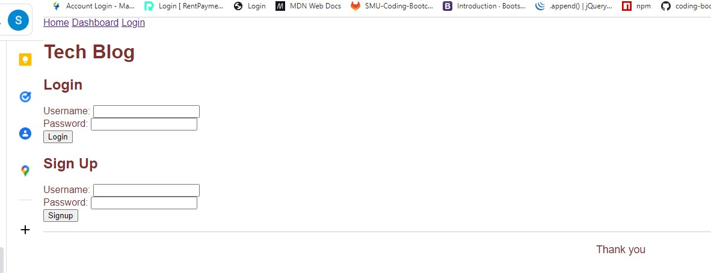
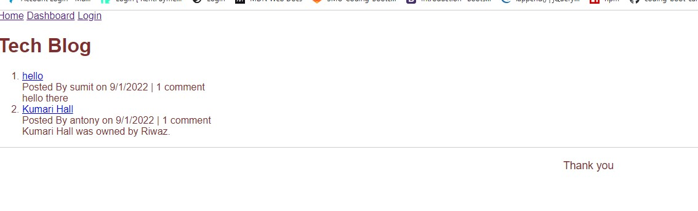

# mvc_tech_blog

## Description

Application to publish articles, blog posts, and thoughts and opinions.

## Table of contents

-[Installation](#Installation) -[Usage](#Usage) -[Contribution](#Contribution) -[Questions](#Questions) -[Screenshots](#Screenshots) -[Website](#Website)

## Installation

- npm init -y
- npm install express sequelize mysql2
- npm install dotenv
- npm install bcrypt
- npm install express-handlebars
- npm install express-session
- npm install connect-session-sequelize

## Usage

- npm start

## Contribution

Sumit Ojha

## Questions

- sumit.ojha.dev@gmail.com
- https://github.com/sumitsann

## Screenshots

## Website

https://protected-harbor-73273.herokuapp.com/
